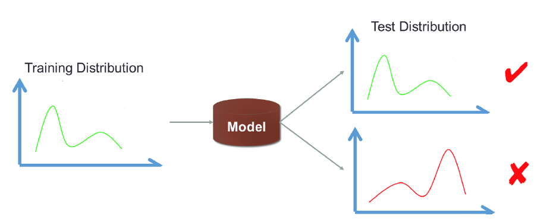
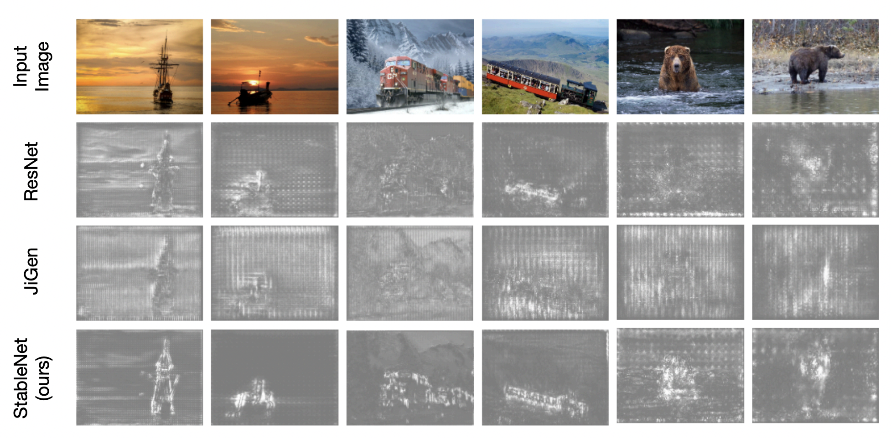

# StableLearn

## Overview
**StableLearn** is a Python package that offers a variety of algorithms designed to support General Tasks Inference. The algorithms introduced in this repository are **model-agnostic**, which can be seamlessly applied across many fields including **Computer Vision, Time Series Forecasting, Policy Learning, Fairness, etc**.

## Table of Contents
1. [Introduction](#introduction)
2. [Sample Reweighting](#1-sample-reweighting)
3. [Data Heterogeneity](#2-data-heterogeneity)
4. [Optimization](#3-optimization)

## Introduction
Approaches based on machine learning and deep neural networks have demonstrated excellent performance when training data and testing data share similar distribution. However, distribution shifts are ubiquitous in real world scenarios, resulting in a notable performance drop of conventional approaches. 

**StableLearn** supports three types of model-agnostic methods to support general inference by handling distribution shifts including Sample reweighting, Data Heterogeneity and Optimization. 

## [Sample Reweighting](./Sample_Reweighting/)

Sample Reweighting approaches are model-agnostic that aims to handle the distribution shifts by assigning different weights to each sample. The reweighted data distribution tries to help the model achieving uniformly good performance under agnostic testing data.

- Stable Learning via Sparse Variable Independence (SVI)

- Covariate-Shift Generalization via Random Sample Weighting (RSW)

- Deep Stable Learning for Out-Of-Distribution Generalization (StableNet)

## [Data Heterogeneity](./Data_Heterogeneity/)

- Heterogeneous Risk Minimization (HRM)

- Kernelized Heterogeneous Risk Minimization (KerHRM)

## [Optimization](./Optimization/)

- Stable Adversarial Learning under Distributional Shifts (SAL)

- Gradient Norm Aware Minimization Seeks First-Order Flatness and Improves Generalization (GAM)

